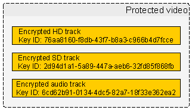
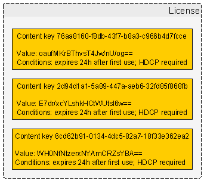
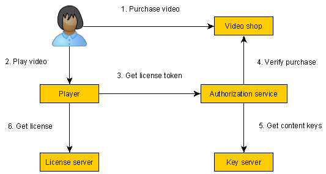

# Axinom DRM - quick start
This guide will show you how you can start using Axinom DRM to protect and play back premium video content.

TODO

It is structured in the following chapters:

1. An overview of modern DRM architecture.
1. Using a sample project with everything already set up.
1. Creating and protecting your own videos.
1. Customizing the DRM configuration.
1. Key management and security practices.

# Basic concepts of DRM

This chapter presents a high-level functional view of DRM concepts. Understand that there is a lot more happening under the covers, especially in the realm of security and key management.

The media samples in a protected video are encrypted with one or more **content keys**, each referenced in the video metadata by its unique key ID.

To play the video, a DRM-capable player needs to decrypt the media samples. For this, it needs access to the concent keys, which are delivered in a **license** that also defines the conditions under which the content keys may be used (e.g. expiration).

The Axinom DRM **license server** will give a license to every player who can prove that they have the right to get a license. The player proves this by presenting a **license token** obtained from an **authorization service** whose responsibility it is to make such decisions and to obtain the appropriate content keys from the **key server**, attaching them in a secured form to the license token.
